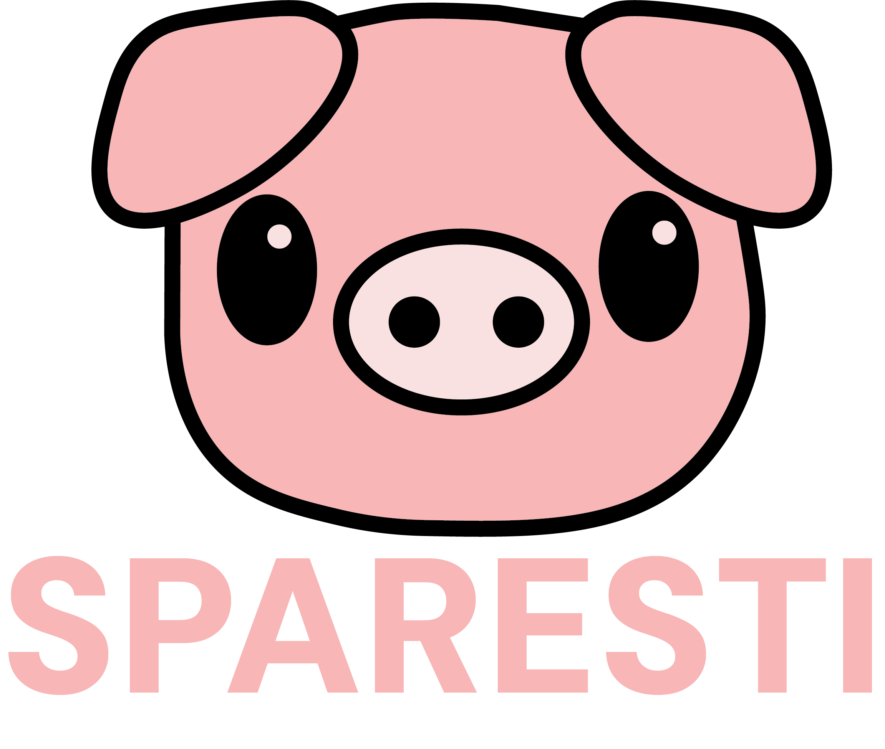

# idatt2106_2024_05 TEAM 5



## Installation

### Prerequisites for building the project

- Git
- Docker
- Make

### Clone the repository
```bash
git clone git@gitlab.stud.idi.ntnu.no:idatt2106_2024_05/idatt2106_2024_05.git
```

### Copy the .env file in the backend and frontend
```bash
cd backend
```
```bash
cp .env.example .env
```
```bash
cd ../Frontend
```
```bash
cp .env.example .env
```
```bash
cd ..
```

## Create user
Create your user, and confirm it with your email to begin using the program. 

## IMPORTANT

The example .env file is empty, and you need to fill in the necessary information for the project to work.
Please contact one of the group members to get the necessary information (emails listed bellow).
This is the case for both the backend and the frontend.

### Build the project (Note: Make sure you have Docker running)
```bash
Make
```

## Further development
If you wish to develop further on the project, these are the needed tools:

#### Utility:

- Git
- Docker
- Make
- IDE (IntelliJ IDEA, Webstorm, VSCode, etc)
- Postman

#### Backend:

- Java 17
- Maven

#### Frontend:

- Vue3 vite

#### Database:

- MySQL

### Running the project:

#### Backend:

```bash
cd Backend
```

```bash
mvn 
```

- Run the Spring Boot application in your IDE

#### Frontend:

```bash
cd Frontend
```

```bash
npm install
```

```bash
npm run dev
```

#### Database:

- Run the MySQL database in a Docker container

## Description

### Saving with AI
Saving has never been more fun and intriguing than with Sparesti. Reach your goals by completing your daily challenges, either created by yourself or by artificial intelligence!

### Community
Collaborate on a goal with a friend, and reach it together. Share your progress with the community and get inspired by others using our social feed.

### Saving turned into a game!
Reach different saving amounts and earn badges! Complete your daily challenges and uphold your streak! See the path to economic freedom!


## Team members

- Elias Trana - eliastt@stud.ntnu.no (Scrum Master)
- Emil Skogheim - emilsko@stud.ntnu.no
- Erik Turmo Nordsæther - eriktn@stud.ntnu.no
- Jacob Forsdahl Iqbal - jacobfi@stud.ntnu.no
- Kristoffer Fredriksen - kristotf@stud.ntnu.no
- Sander Rom Skofsrud - sandesko@stud.ntnu.no
- Talian Stangebye-Hansen - 
- Vegard Johnsen - vejoh@stud.ntnu.no


